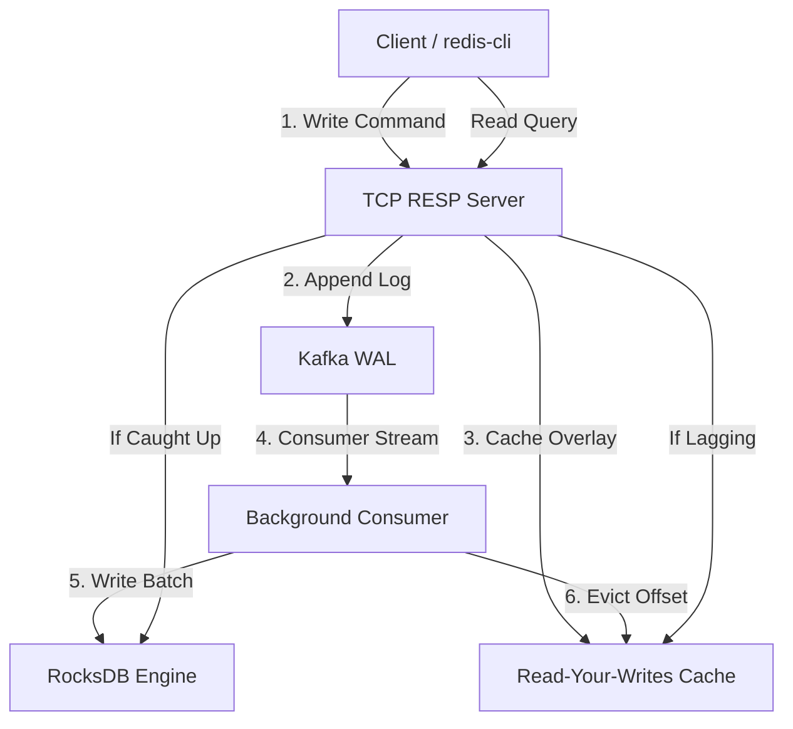

# KVSDB: Kafka-backed Event-Sourced Key-Value Store

KVSDB is a persistent, event-sourced key-value store using Apache Kafka as a Write-Ahead Log (WAL) and RocksDB as a materialized state store. It exposes a Redis-compatible TCP interface, allowing clients to query and write using standard Redis clients (like `redis-cli`).

---

## Architecture Design



---

## Subsystem Architecture & Flows

### 1. RESP TCP Server & Parser
Exposes a standard Redis-compatible TCP interface on port `:6379`. Incoming client commands are parsed from standard RESP2 wire frames using `bufio.Reader` for network safety, allowing KVSDB to interface with any native Redis client (`redis-cli`, libraries) out-of-the-box.

### 2. Write-Ahead Log (WAL) & Audit Trail
Apache Kafka acts as the single source of truth. Every mutating command (`SET`, `DEL`, `EXPIRE`) is written strictly to Kafka first. Write commands return immediately once Kafka acknowledges delivery, guaranteeing durability. The immutable Kafka log serves as a permanent changelog, allowing complete reconstruction of database state at any specific historical offset.

### 3. State Materialization
A background consumer subscribes to the Kafka topic, reads the log sequentially, and applies the writes to RocksDB. RocksDB maintains the state in a structured LSM-tree. For partition offset tracking, the consumer atomically commits the processed offset in a metadata Column Family within the same RocksDB write transaction.

### 4. Read-Your-Writes (RYW) Consistency
To bridge consumer replication lag, an in-memory `rywCache` overlay intercepts reads:
*   On a write command, the server receives the Kafka offset and registers the key, value, and offset in the `rywCache`.
*   On a read command (`GET`), the server checks the cache. If the background consumer's current offset is less than the write offset, the server serves the read from the cache overlay.
*   Once the consumer catches up to the offset, the cache entry is evicted, and reads fall back directly to RocksDB.

### 5. Binary Wrapped Lazy TTL
Expirations are stored inline with values to avoid the performance overhead of background TTL scan threads:
*   Every value is wrapped with a binary header: `[ "KVS1" (4 bytes) ] [ Expiration UnixNano (8 bytes) ] [ Raw Value ]`.
*   Legacy unwrapped keys are automatically handled for backwards compatibility.
*   When a key is queried (`GET`, `TTL`), the expiration is evaluated. If expired, KVSDB lazily deletes the key from disk and returns empty.

### 6. Snapshot & Restore
Snapshots are created using RocksDB's Checkpoint API, which generates filesystem hard links with zero performance overhead.
*   During startup, KVSDB checks the snapshot directory and automatically recovers the latest snapshot if the database is cold.
*   The system reads the last processed offsets stored in the snapshot's metadata Column Family and resumes Kafka consumption from `offset + 1`.
*   During snapshotting, consumer execution is frozen briefly using a synchronization read/write lock to prevent corrupted check-pointing.

---

## Command Reference

| Command | Syntax | RESP Return | Example |
| :--- | :--- | :--- | :--- |
| **SET** | `SET key value` | Simple String `+OK` | `SET user:1 "Alice"` |
| **GET** | `GET key` | Bulk String or `$-1` (nil) | `GET user:1` |
| **DEL** | `DEL key` | Integer `:1` (deleted), `:0` (not found) | `DEL user:1` |
| **MSET** | `MSET k1 v1 k2 v2...` | Simple String `+OK` | `MSET user:1 "Alice" user:2 "Bob"` |
| **MGET** | `MGET k1 k2...` | Array of Bulk Strings / `$-1` | `MGET user:1 user:2` |
| **EXPIRE**| `EXPIRE key seconds` | Integer `:1` (success), `:0` (key missing) | `EXPIRE user:1 60` |
| **TTL** | `TTL key` | Remaining seconds, `-1` (no expiry), `-2` (missing) | `TTL user:1` |
| **SCAN** | `SCAN cursor [MATCH prefix] [COUNT count]` | Nested Array: `[nextCursor, [keys...]]` | `SCAN 0 MATCH user:* COUNT 10` |
| **SAVE** | `SAVE` | Simple String `+SNAPSHOT CREATED` | `SAVE` |
| **INFO** | `INFO` | System metrics Bulk String | `INFO` |
| **PING** | `PING [msg]` | Bulk String `msg` or `+PONG` | `PING "hello"` |

---

## Setup & Running

### Requirements
*   **Docker** (for Kafka / Zookeeper)
*   **Go** (1.20+)
*   **RocksDB** libraries installed on your host system:
    *   Arch Linux: `sudo pacman -S rocksdb`
    *   Ubuntu/Debian: `sudo apt-get install librocksdb-dev`

### Running the Services
1.  **Start Kafka Broker:**
    ```bash
    docker compose up -d
    ```

2.  **Start the KVSDB Server:**
    ```bash
    go run ./cmd/server/main.go
    ```

3.  **Interact with KVSDB:**
    Use `redis-cli` from any Redis installation or start one via Docker:
    ```bash
    docker run --rm -it --network host redis:alpine redis-cli
    ```
    Now you can run operations:
    ```redis
    127.0.0.1:6379> MSET user:1 "Alice" user:2 "Bob"
    OK
    127.0.0.1:6379> MGET user:1 user:2
    1) "Alice"
    2) "Bob"
    127.0.0.1:6379> INFO
    # Server
    kvsdb_version:1.0.0
    ...
    ```

---

## Configuration
KVSDB is configured via environment variables. Defaults are loaded automatically if the variables are unset:

*   `KAFKA_BOOTSTRAP_SERVERS` (Default: `localhost:9092`)
*   `KAFKA_WAL_TOPIC` (Default: `kvsdb-wal`)
*   `KAFKA_GROUP_ID` (Default: `kvsdb-consumer-group`)
*   `SERVER_ADDR` (Default: `:6379`)
*   `ROCKSDB_PATH` (Default: `tmp/rocksdb`)
*   `SNAPSHOT_DIR` (Default: `tmp/snapshots`)